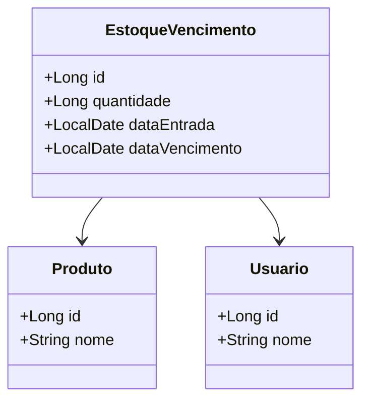

#Controler de estoque por vencimento

##Diagrama de classes

```mermaid
classDiagram
    class EstoqueVencimento  {
        +Long  id
        +Long  quantidade
        +LocalDate dataEntrada
        +LocalDate dataVencimento
    }

    class Produto {
        +Long  id
        +String nome
    }

    class Usuario {
        +Long  id
        +String nome
    }

    EstoqueVencimento  --> Produto 
    EstoqueVencimento  --> Usuario 
```
