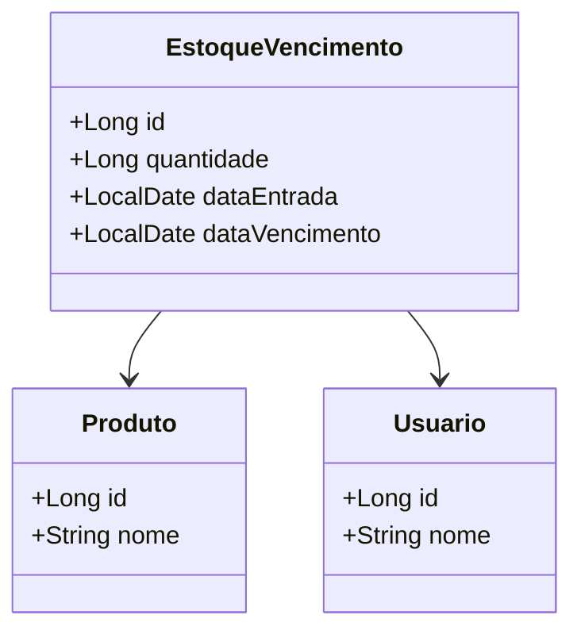

# Controler de estoque por vencimento

## Diagrama de classes

Esta API foi criada para gerenciar o estoque de produtos perecíveis, com foco especial na data de vencimento. O sistema consome dados de APIs de terceiros para produtos e usuários, e gerencia o estoque com base em datas.

### Funcionalidades

- **Criação de Entradas de Estoque:** Adiciona novos produtos ao inventário com sua respectiva data de vencimento.
- **Listagem de Itens:** Retorna todos os itens em estoque.
- **Alertas de Vencimento (listarProximosVencimentos):** Retorna uma lista de itens que irão vencer nos próximos 10 dias.
- **Visualização de Detalhes:** Permite a busca por um item específico.
- **ListarVencidos:** Lista todos os item vencidos.

### Endpoints da API

A API está disponível no seguinte endereço base: `/api/estoque`

| Método   | Endpoint                | Descrição                                      |
|:---------| :---------------------- |:-----------------------------------------------|
| `POST`   | `/`                     | Adiciona um novo item ao estoque.              |
| `GET`    | `/`                     | Lista todos os itens do estoque.               |
| `GET`    | `/proximos-vencimentos`             | Retorna itens que vencem nos próximos 10 dias. |
| `GET`    | `/{id}`                 | Busca um item específico por ID.               |
| `PUT`    | `/{id}`                 | Atualiza as informações de um item.            |
| `DELETE` |`/{id}`                 | Remove um item do estoque.                     |
| `GET`    |`/vencidos`               | Lista itens vencidos no estoque.            |

### Como Rodar o Projeto

1.  **Clone o repositório:**
    ```bash
    git clone [https://github.com/seu-usuario/seu-repositorio.git](https://github.com/Jnpacheco-125/estoque-vencimento-api.git)
    cd seu-repositorio
    ```
2.  **Configuração do Perfil:**
    Certifique-se de que o perfil `dev` está ativo. Você pode configurá-lo no seu `application.yml` ou através das opções da VM na IDE.
3.  **Execute a Aplicação:**
    ```bash
    ./mvnw spring-boot:run
    ```

### Tecnologias Utilizadas

- **Linguagem:** Java 17
- **Framework:** Spring Boot
- **Persistência:** Spring Data JPA & Hibernate
- **Banco de Dados:** H2 (em memória para desenvolvimento)

---

### Tarefas Futuras

- [ ] Implementar autenticação e autorização para os endpoints da API.
- [ ] Adicionar suporte para um banco de dados de produção (PostgreSQL).
- [ ] Criar testes unitários e de integração para os serviços e controladores.
- [ ] Pode subir na sua nuvem de preferencia, configurando o perfil de `prd`.